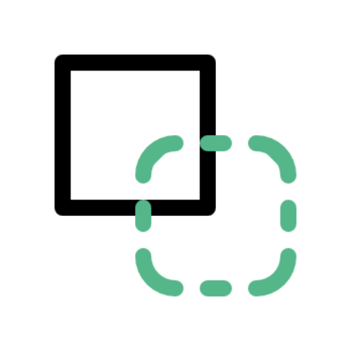

# Website Cloner 

A desktop app that allow users to download website files on computer. 
It help to download a full frontend source code html,css,js,images,fonts...

### Downloads:
| Platform | Version | Link                                                                                                                         |
| -------- | ------- | ---------------------------------------------------------------------------------------------------------------------------- |
| Windows  | ✅   | [Download (.exe)](https://github.com/X-SLAYER/website-cloner-dart/releases/download/Latest/website_cloner-1.0.0+1-windows.exe)  |
| Mac      |  ❌   | until i buy a mac  |
| Linux    | ✅   | [Download (.deb)](https://github.com/X-SLAYER/website-cloner-dart/releases/download/Latest/website_cloner-1.0.0+1-linux.deb)  |

## ScreenShot

## Goals

- [x] Download All assets
- [x] Work on linux / windows
- [x] Add custom headers.
- [ ] Rename resources path
- [ ] Download multiple pages
